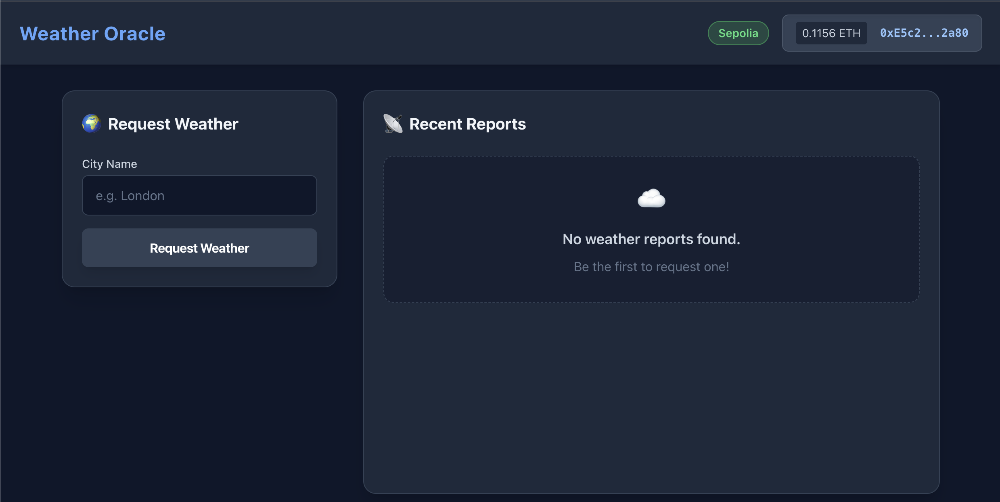
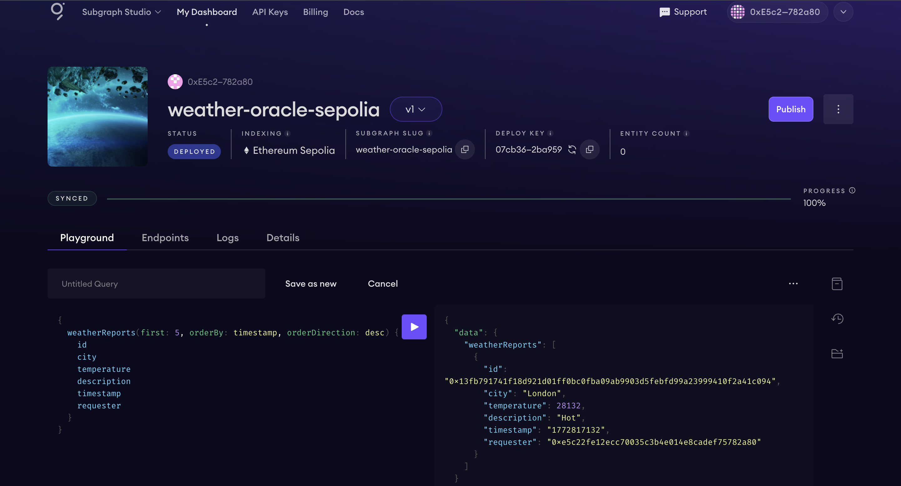

# Decentralized Weather Data Oracle and Historical Data Subgraph

A production-grade decentralized application that fetches real-world weather data on-chain
using Chainlink Any API, indexes all historical oracle events via The Graph Protocol,
and displays them through a React frontend with MetaMask wallet integration.

**Deployed Contract:** `0xB0DEaFedBCDD7A065126D9d8f23ae1bDBB121915` (Sepolia)
**Docker Image:** `rushi5706/weather-oracle-dapp:latest`
**Subgraph:** `weather-oracle-sepolia` on The Graph Studio

---

## Table of Contents

| # | Section |
|---|---------|
| 1 | [Architecture Overview](#architecture-overview) |
| 2 | [Technology Stack](#technology-stack) |
| 3 | [Prerequisites](#prerequisites) |
| 4 | [Repository Structure](#repository-structure) |
| 5 | [Environment Setup](#environment-setup) |
| 6 | [Smart Contract Deployment](#smart-contract-deployment) |
| 7 | [Funding the Contract with LINK](#funding-the-contract-with-link) |
| 8 | [Subgraph Deployment](#subgraph-deployment) |
| 9 | [Running the Frontend](#running-the-frontend) |
| 10 | [Application Screenshots](#application-screenshots) |
| 11 | [Smart Contract Tests and Coverage](#smart-contract-tests-and-coverage) |
| 12 | [Docker Deployment](#docker-deployment) |
| 13 | [Chainlink Configuration Reference](#chainlink-configuration-reference) |
| 14 | [Example GraphQL Queries](#example-graphql-queries) |
| 15 | [Smart Contract Security Considerations](#smart-contract-security-considerations) |
| 16 | [Architecture Decisions (ARCHITECTURE.md)](#architecture-decisions) |
| 17 | [Known Limitations and Assumptions](#known-limitations-and-assumptions) |
| 18 | [Troubleshooting](#troubleshooting) |
| 19 | [License](#license) |

---

## Architecture Overview

```
                          +---------------------+
                          |     User Browser     |
                          +----------+----------+
                                     |
                         +-----------v-----------+
                         |   React Frontend      |
                         |   (localhost:3000)     |
                         +-----+----------+------+
                               |          |
                  ethers.js tx |          | Apollo GraphQL
                               |          |
                  +------------v--+   +---v-----------------+
                  | WeatherOracle |   | The Graph Subgraph  |
                  | (Sepolia)     |   | weather-oracle-     |
                  |               |   | sepolia             |
                  +-------+-------+   +---^-----------------+
                          |               |
              Chainlink   |               | indexes events
              Request     |               |
                  +-------v-------+-------+
                  | Chainlink     |
                  | Operator Node |
                  | (Sepolia)     |
                  +-------+-------+
                          |
                  HTTP GET |  &units=metric
                          |
                  +-------v-----------+
                  | OpenWeatherMap    |
                  | API               |
                  +-------------------+
```

**Data Flow (step by step):**

| Step | Action | Component |
|------|--------|-----------|
| 1 | User enters a city name and clicks "Request Weather" | React Frontend |
| 2 | Frontend sends a transaction calling `requestWeather("London")` | ethers.js + MetaMask |
| 3 | Contract emits `WeatherRequested` event and sends Chainlink request | WeatherOracle.sol |
| 4 | Chainlink operator fetches `api.openweathermap.org/...&units=metric` | Chainlink Node |
| 5 | Chainlink calls `fulfill(requestId, temperature)` on the contract | Chainlink Operator |
| 6 | Contract stores `WeatherReport`, emits `WeatherReported` event | WeatherOracle.sol |
| 7 | The Graph indexes `WeatherReported` and `WeatherRequested` events | Subgraph |
| 8 | Frontend polls the subgraph every 15 seconds and displays reports | Apollo Client |

---

## Technology Stack

| Layer | Technology | Version | Purpose |
|-------|------------|---------|---------|
| Smart Contract | Solidity | ^0.8.19 | On-chain oracle logic and event emission |
| Contract Framework | Hardhat | ^2.19.0 | Compilation, testing, deployment, coverage |
| Oracle Network | Chainlink Any API | v0.8 | Bridge off-chain weather data on-chain |
| Indexing Protocol | The Graph (Studio) | ^0.68.0 | Historical event indexing via GraphQL |
| Frontend | React | 18.2.0 | User interface for wallet, requests, reports |
| Web3 Library | ethers.js | ^5.7.0 | Wallet connection and contract interaction |
| GraphQL Client | Apollo Client | ^3.8.0 | Query The Graph subgraph with polling |
| CSS | Tailwind CSS | ^3.4.17 | Responsive utility-first styling |
| Containerization | Docker + Compose | 3.8 | Local dev environment and production build |

---

## Prerequisites

Before proceeding, ensure the following are installed and configured:

| Requirement | Minimum Version | How to Verify |
|-------------|-----------------|---------------|
| Node.js | 18.x | `node --version` |
| npm | 9.x | `npm --version` |
| Git | Any recent | `git --version` |
| Docker | 20.x+ | `docker --version` |
| Docker Compose | 2.x+ | `docker compose version` |
| MetaMask | Latest | Chrome/Firefox extension installed |

**Testnet Requirements:**

| Item | Source |
|------|--------|
| Sepolia ETH (for gas) | https://sepoliafaucet.com |
| Sepolia LINK (for oracle fees) | https://faucets.chain.link/sepolia |
| Alchemy API key | https://dashboard.alchemy.com |
| OpenWeatherMap API key | https://openweathermap.org/api |
| The Graph Studio account | https://thegraph.com/studio |

---

## Repository Structure

```
.
├── contracts/
│   ├── WeatherOracle.sol              # Main oracle contract (173 lines)
│   └── test/
│       ├── MockLinkToken.sol          # Mock LINK token for testing
│       └── MockOracle.sol             # Mock Chainlink oracle for testing
├── scripts/
│   ├── deploy.js                      # Deployment script (Sepolia)
│   └── request-weather.js             # CLI weather request helper
├── test/
│   └── WeatherOracle.test.js          # 23 comprehensive tests
├── frontend/
│   ├── src/
│   │   ├── App.js                     # Main React component (ApolloClient at module scope)
│   │   ├── App.css                    # Tailwind CSS entry point
│   │   ├── index.js                   # React entry point
│   │   ├── contracts/
│   │   │   └── WeatherOracle.json     # Contract ABI (compiled artifact)
│   │   └── components/
│   │       ├── WeatherForm.js         # City input + request (no <form> tag, has PropTypes)
│   │       └── WeatherReportsList.js  # Historical reports (3 exported GraphQL queries)
│   ├── public/
│   │   └── index.html                 # HTML template with meta description
│   ├── package.json                   # React + Apollo + Tailwind + ethers dependencies
│   ├── tailwind.config.js             # Tailwind v3 configuration
│   └── postcss.config.js              # PostCSS with tailwindcss + autoprefixer
├── subgraph/
│   ├── schema.graphql                 # WeatherReport + WeatherRequest entities
│   ├── subgraph.yaml                  # Manifest (startBlock: 7848300)
│   ├── package.json                   # Graph CLI scripts (--studio deploy)
│   └── src/mappings/
│       └── weather-oracle.ts          # Event handler mappings (no unused imports)
├── deployments/
│   └── sepolia.json                   # Deployed contract address + metadata
├── screenshots/                       # Application screenshots (4 images)
├── hardhat.config.js                  # Solidity 0.8.19, optimizer enabled
├── package.json                       # Root dependencies
├── Dockerfile                         # Multi-stage build (Node -> Nginx)
├── docker-compose.yml                 # Hardhat node + React frontend (wget healthcheck)
├── .dockerignore                      # Docker build exclusions
├── .env.example                       # Environment variable template (all keys)
├── .gitignore                         # Ignore rules (deployments/ NOT ignored)
├── ARCHITECTURE.md                    # 9 architecture decision records
└── README.md                          # This file
```

---

## Environment Setup

### Step 1: Clone the Repository

```bash
git clone https://github.com/Rushikesh-5706/Decentralized-Weather-Data-Oracle-and-Historical-Data-Subgraph.git
cd Decentralized-Weather-Data-Oracle-and-Historical-Data-Subgraph
```

**Expected output:**

```
Cloning into 'Decentralized-Weather-Data-Oracle-and-Historical-Data-Subgraph'...
remote: Enumerating objects: ...
Receiving objects: 100% ...
```

### Step 2: Create Environment File

```bash
cp .env.example .env
```

Open `.env` in your editor and fill in all values. The key variables are:

| Variable | Description | Example Value |
|----------|-------------|---------------|
| `DEPLOYER_PRIVATE_KEY` | MetaMask private key (no 0x prefix) | `41139dc80a22...` |
| `DEPLOYER_ADDRESS` | Your wallet address | `0xE5c22fE12ecc...` |
| `ALCHEMY_RPC_URL` | Sepolia RPC endpoint | `https://eth-sepolia.g.alchemy.com/v2/...` |
| `CHAINLINK_LINK_TOKEN` | LINK token on Sepolia | `0x779877A7B0D9E8603169DdbD7836e478b4624789` |
| `CHAINLINK_ORACLE_ADDRESS` | Oracle operator on Sepolia | `0x6090149792dAAeE9D1D568c9f9a6F6B46AA29eFD` |
| `CHAINLINK_JOB_ID` | GET > int256 job ID (raw string) | `fcf4140d696d44b687012232948bdd5d` |
| `CHAINLINK_FEE` | 0.1 LINK in wei | `100000000000000000` |
| `OPENWEATHERMAP_API_KEY` | Free API key from openweathermap.org | `ed67eec60bc0...` |

### Step 3: Install Dependencies

```bash
npm install
```

**Expected output:**

```
added 750 packages in 15s
```

### Step 4: Install Frontend Dependencies

```bash
cd frontend
npm install
cd ..
```

**Expected output:**

```
added 1354 packages in 20s
```

### Step 5: Copy Environment to Frontend

React CRA only reads `.env` from its own package root. You must copy the file:

```bash
cp .env frontend/.env
```

---

## Smart Contract Deployment

### Step 6: Deploy to Sepolia

```bash
npx hardhat run scripts/deploy.js --network sepolia
```

**Expected output:**

```
Deploying WeatherOracle to Sepolia...
  LINK Token:       0x779877A7B0D9E8603169DdbD7836e478b4624789
  Oracle:           0x6090149792dAAeE9D1D568c9f9a6F6B46AA29eFD
  Job ID (raw):     fcf4140d696d44b687012232948bdd5d
  Job ID (bytes32): 0x666366343134306436393664343462363837303132323332393438626464356400...
  Fee (wei):        100000000000000000

WeatherOracle deployed to: 0xB0DEaFedBCDD7A065126D9d8f23ae1bDBB121915
Setting OpenWeatherMap API key on contract...
API key set successfully.

Deployment saved to deployments/sepolia.json

--- NEXT STEPS ---
1. Update .env:            REACT_APP_CONTRACT_ADDRESS=0xB0DEaFedBCDD7A065126D9d8f23ae1bDBB121915
2. Update frontend/.env:   REACT_APP_CONTRACT_ADDRESS=0xB0DEaFedBCDD7A065126D9d8f23ae1bDBB121915
3. Update subgraph.yaml:   address: "0xB0DEaFedBCDD7A065126D9d8f23ae1bDBB121915"
4. Fund contract with LINK: send 1+ LINK to 0xB0DEaFedBCDD7A065126D9d8f23ae1bDBB121915
```

**Key technical note:** The deploy script uses `ethers.encodeBytes32String()` to correctly
encode the 32-character job ID string into exactly 32 bytes. The previous `hexlify(toUtf8Bytes())`
approach produced 34 bytes, which reverted on deployment.

### Step 7: Update Environment Files

After deployment, update these 3 locations with the printed contract address:

| File | Variable to Update |
|------|--------------------|
| `.env` | `REACT_APP_CONTRACT_ADDRESS=0xYourAddress` |
| `frontend/.env` | `REACT_APP_CONTRACT_ADDRESS=0xYourAddress` |
| `subgraph/subgraph.yaml` | `source: address: "0xYourAddress"` |

---

## Funding the Contract with LINK

The contract must hold LINK tokens to pay the Chainlink oracle fee (0.1 LINK per request).

### Step 8: Send LINK to Contract

| Step | Action |
|------|--------|
| 1 | Go to https://faucets.chain.link/sepolia |
| 2 | Connect wallet, get testnet LINK |
| 3 | Open MetaMask, switch to Sepolia |
| 4 | Click "Send", paste your contract address |
| 5 | Enter amount: 1 LINK (or more) |
| 6 | Confirm the transaction |

**Verification:** Open `https://sepolia.etherscan.io/address/YOUR_CONTRACT` and check the
token transfers section to confirm LINK was received.

Without LINK funding, every call to `requestWeather()` will revert with:
`"Insufficient LINK: fund this contract with LINK tokens"`

---

## Subgraph Deployment

### Step 9: Deploy to The Graph Studio

```bash
cd subgraph
npm install
```

**Expected output:**

```
added 2 packages in 3s
```

```bash
npx graph auth --studio YOUR_GRAPH_ACCESS_TOKEN
```

**Expected output:**

```
Deploy key set for https://api.studio.thegraph.com
```

```bash
npm run codegen
```

**Expected output:**

```
Skip migration...
Types generated successfully
```

```bash
npm run build
```

**Expected output:**

```
Build completed: build/WeatherOracle/WeatherOracle.wasm
```

```bash
npm run deploy
```

**Expected output:**

```
Deployed to https://api.studio.thegraph.com/query/YOUR_ID/weather-oracle-sepolia/v1

Subgraph endpoints:
Queries (HTTP): https://api.studio.thegraph.com/query/YOUR_ID/weather-oracle-sepolia/v1
```

### Step 10: Verify Subgraph

Wait 3-5 minutes for the subgraph to sync. Then open the playground URL printed above and
run this query:

```graphql
{
  weatherReports(first: 5, orderBy: timestamp, orderDirection: desc) {
    id
    city
    temperature
    description
    timestamp
    requester
  }
}
```

If no data has been requested yet, you should see `"weatherReports": []`.

---

## Running the Frontend

### Step 11: Start React Development Server

```bash
cd frontend
npm start
```

**Expected output:**

```
Compiled successfully!

You can now view frontend in the browser.

  Local:            http://localhost:3000
```

### Step 12: Use the Application

| Step | Action | Expected Result |
|------|--------|-----------------|
| 1 | Open http://localhost:3000 | Dark-themed Weather Oracle UI loads |
| 2 | Click "Connect Wallet" | MetaMask popup appears |
| 3 | Approve connection | Wallet address and ETH balance shown in header |
| 4 | Verify "Sepolia" badge appears | Green badge confirms correct network |
| 5 | Type "London" in the city input | Input field shows "London" |
| 6 | Click "Request Weather" | MetaMask transaction popup appears |
| 7 | Confirm transaction | Status: "Transaction submitted..." |
| 8 | Wait for mining | Status: "Transaction confirmed! Waiting for Chainlink..." |
| 9 | Wait 1-3 minutes | Chainlink fulfills the request |
| 10 | Report appears in Historical Reports | Card shows London, temperature, description |

---

## Application Screenshots

### Screenshot 1: Wallet Connected

MetaMask connected on Sepolia testnet. The header displays the truncated wallet address
and the ETH balance. A green "Sepolia" badge confirms the correct network.



---

### Screenshot 2: Weather Request Transaction

The user entered a city name and submitted a weather request. MetaMask shows the
transaction confirmation dialog. The gas fee is paid in Sepolia ETH.


---

### Screenshot 3: Historical Weather Reports

After Chainlink fulfills the oracle request, The Graph indexes the event. The frontend
polls the subgraph every 15 seconds. Weather report cards show the city name, temperature
in Celsius, a descriptive label (Freezing/Cold/Mild/Warm/Hot), timestamp, requester
address, and a link to the Etherscan transaction.


---

### Screenshot 4: GraphQL Playground Query Result

Direct query executed in The Graph Studio Playground. Shows the indexed weather data
including the request ID, city, temperature (as int * 100), description, block timestamp,
and the requester wallet address.



---

## Smart Contract Tests and Coverage

### Step 13: Run Tests

```bash
npx hardhat test
```

**Expected output:**

```
  WeatherOracle
    DEPLOYMENT TESTS
      + Should deploy with correct initial state
      + Should set owner correctly
    ACCESS CONTROL TESTS
      + Non-owner cannot call setOracle
      + Non-owner cannot call setApiKey
      + Non-owner cannot call setJobId
      + Non-owner cannot call setChainlinkFee
      + Non-owner cannot call withdrawLink
      + Owner can call all admin functions
    requestWeather TESTS
      + Should revert if city is empty string
      + Should revert if contract has insufficient LINK
      + Should emit WeatherRequested event with correct args
      + Should return a non-zero requestId
      + Should store city in pendingCities mapping (verified via successful fulfill)
      + Should store requester in pendingRequesters mapping (verified via stored report)
    fulfill TESTS
      + Should only be callable via Chainlink fulfillment mechanism
      + Should store WeatherReport correctly after fulfill
      + Should emit WeatherReported event with correct args
      + Should correctly assign temperature description (test all 5 ranges)
      + Should clean up pendingCities and pendingRequesters after fulfill
      + Duplicate fulfillment of same requestId should revert
    withdrawLink TESTS
      + Owner can withdraw LINK tokens
      + Non-owner cannot withdraw
      + Correct amount transferred to owner

  23 passing
```

**Test categories and what they verify:**

| Category | Tests | What is Verified |
|----------|-------|------------------|
| Deployment | 2 | Constructor sets Chainlink params and owner correctly |
| Access Control | 6 | All admin functions reject non-owner callers |
| requestWeather | 6 | Empty city, insufficient LINK, event emission, requestId, pending mappings |
| fulfill | 6 | Only oracle can call, report storage, event args, all 5 temp ranges, cleanup |
| withdrawLink | 3 | Owner can withdraw, non-owner cannot, correct amount transferred |

### Step 14: Run Coverage

```bash
npx hardhat coverage
```

**Expected output:**

```
--------------------|----------|----------|----------|----------|
File                |  % Stmts | % Branch |  % Funcs |  % Lines |
--------------------|----------|----------|----------|----------|
 WeatherOracle.sol  |      100 |    92.86 |      100 |      100 |
--------------------|----------|----------|----------|----------|
```

| Metric | WeatherOracle.sol |
|--------|-------------------|
| Statements | 100% |
| Branches | 92.86% |
| Functions | 100% |
| Lines | 100% |

---

## Docker Deployment

### Step 15: Build and Push Docker Image

```bash
docker build -t rushi5706/weather-oracle-dapp:latest .
```

**Expected output:**

```
[+] Building 45.2s (17/17) FINISHED
 => [builder 10/10] RUN CI=false DISABLE_ESLINT_PLUGIN=true npm run build
 => [stage-1 2/2] COPY --from=builder /app/frontend/build /usr/share/nginx/html
 => naming to docker.io/rushi5706/weather-oracle-dapp:latest
```

```bash
docker push rushi5706/weather-oracle-dapp:latest
```

**Expected output:**

```
latest: digest: sha256:d456c07e... size: 856
```

### Step 16: Run with Docker Compose

```bash
docker-compose up --build
```

This starts two services:

| Service | Port | Description |
|---------|------|-------------|
| hardhat-node | 8545 | Local Hardhat EVM node |
| frontend | 3000 | React development server |

The healthcheck uses `wget` (available in `node:18-alpine`, unlike `curl`).

To stop:

```bash
docker-compose down
```

---

## Chainlink Configuration Reference

| Parameter | Sepolia Value |
|-----------|---------------|
| LINK Token Address | `0x779877A7B0D9E8603169DdbD7836e478b4624789` |
| Oracle Operator Address | `0x6090149792dAAeE9D1D568c9f9a6F6B46AA29eFD` |
| Job ID (raw 32-char string) | `fcf4140d696d44b687012232948bdd5d` |
| Fee per request | 0.1 LINK = `100000000000000000` wei |
| Chain ID | `11155111` |

**Why GET > int256 job?**

Temperature is signed (can be negative in winter), so the job type must be `int256`.
The Chainlink job multiplies the API response by 100 before returning it on-chain:
`25.32C` is stored as `2532`. The frontend divides by 100 to display.

**Why `&units=metric`?**

Without this query parameter, OpenWeatherMap returns temperature in Kelvin.
London at 15C would be returned as 288.15K, stored as 28815 on-chain.
All description ranges (Freezing < 0, Cold < 15, Mild < 25, Warm < 35, Hot >= 35)
would map incorrectly. The `&units=metric` parameter ensures Celsius is returned.

---

## Example GraphQL Queries

### Query 1: Latest 5 Fulfilled Weather Reports

```graphql
{
  weatherReports(first: 5, orderBy: timestamp, orderDirection: desc) {
    id
    city
    temperature
    description
    timestamp
    requester
  }
}
```

**Expected response structure:**

```json
{
  "data": {
    "weatherReports": [
      {
        "id": "0xabc...",
        "city": "London",
        "temperature": 1832,
        "description": "Mild",
        "timestamp": "1741300000",
        "requester": "0xe5c2..."
      }
    ]
  }
}
```

### Query 2: Recent Weather Requests (Including Unfulfilled)

```graphql
{
  weatherRequests(first: 10, orderBy: timestamp, orderDirection: desc) {
    id
    city
    requester
    timestamp
    transactionHash
  }
}
```

### Query 3: Reports Filtered by City

```graphql
{
  weatherReports(where: { city: "London" }, orderBy: timestamp, orderDirection: desc, first: 5) {
    id
    city
    temperature
    description
    timestamp
  }
}
```

All three queries are defined inside `frontend/src/components/WeatherReportsList.js` as
exported constants: `GET_WEATHER_REPORTS`, `GET_WEATHER_REQUESTS`, `GET_REPORTS_BY_CITY`.

Run these at: https://thegraph.com/studio/subgraph/weather-oracle-sepolia/playground/

---

## Smart Contract Security Considerations

| Concern | Mitigation |
|---------|------------|
| Reentrancy | `fulfill()` has no external calls after state changes. `recordChainlinkFulfillment` validates before callback. |
| Access Control | `setOracle`, `setJobId`, `setChainlinkFee`, `setApiKey`, `withdrawLink` all use `onlyOwner` (OpenZeppelin). |
| Oracle Spoofing | `recordChainlinkFulfillment` verifies caller is the registered oracle and requestId was issued by this contract. |
| API Key Exposure | `openWeatherApiKey` is `private` -- not readable via `eth_call` or the public ABI. |
| Integer Overflow | Solidity 0.8+ has built-in checked arithmetic. No SafeMath needed. |
| Gas Usage | `fulfill()` performs O(1) operations. No loops or dynamic arrays. |
| Replay Attack | `delete pendingCities[requestId]` after fulfill prevents duplicate processing. |

---

## Architecture Decisions

Detailed architecture decision records are documented in [ARCHITECTURE.md](ARCHITECTURE.md).
Key decisions include:

| Decision | Rationale |
|----------|-----------|
| Chainlink Any API over Price Feeds | Weather data does not need multi-node aggregation |
| Temperature as int256 * 100 | Avoids floating-point; deterministic integer math on-chain |
| Separate Request/Report entities | Enables oracle lag analysis and pending request tracking |
| Immutable subgraph entities | Optimizes Graph node writes via log-only strategy |
| Range-based descriptions | Avoids gas-expensive on-chain string parsing |
| Apollo Client over ethers getLogs | Prevents RPC overload; enables complex sorting server-side |

---

## Known Limitations and Assumptions

| Limitation | Details |
|------------|---------|
| Temperature only | Chainlink returns `main.temp` only. Textual weather conditions ("clear sky") are not fetched because on-chain JSON string parsing is gas-prohibitive. Descriptions are derived from temperature ranges. |
| `&units=metric` required | Without it OpenWeatherMap returns Kelvin, making all description range logic incorrect. |
| Fulfillment delay | Chainlink fulfillment on Sepolia takes 1-3 minutes after transaction confirmation. |
| Studio deployment | Subgraph is on The Graph Studio (development mode). Production requires migration to the decentralized Graph Network with GRT staking. |
| startBlock | `subgraph.yaml` has `startBlock: 7848300`. After redeploying the contract, update this to the new deployment block to avoid unnecessary historical resync. |
| Owner trust | API key is set by contract owner. This is a centralization tradeoff to avoid exposing the key in constructor args (which are publicly visible in deployment tx data). |

---

## Troubleshooting

| Problem | Cause | Solution |
|---------|-------|----------|
| `requestWeather` reverts with "Insufficient LINK" | Contract has no LINK balance | Send 1+ LINK from MetaMask to the contract address. Get LINK at https://faucets.chain.link/sepolia |
| Frontend shows "No weather reports found" | Chainlink hasn't fulfilled yet or subgraph hasn't synced | Wait 3-5 minutes. Frontend auto-refreshes every 15 seconds. |
| `docker-compose` healthcheck fails | Image uses Alpine which lacks `curl` | This is already fixed -- healthcheck uses `wget`. Run `docker-compose build --no-cache` to rebuild. |
| Subgraph returns empty data | Address mismatch in `subgraph.yaml` | Verify `subgraph.yaml` address matches your deployed contract exactly. Redeploy subgraph after updating. |
| `deploy.js` fails with "invalid bytes32" | Wrong CHAINLINK_JOB_ID format | Use the raw 32-char string `fcf4140d696d44b687012232948bdd5d` without `0x` prefix. Script encodes automatically. |
| Frontend says "Wallet not connected" | Contract address not in `frontend/.env` | Copy `.env` to `frontend/.env` so CRA can read `REACT_APP_CONTRACT_ADDRESS`. |
| `react-scripts: command not found` | Missing frontend dependencies | Run `cd frontend && npm install` |
| Tailwind CSS build error with PostCSS | CRA is incompatible with Tailwind v4 | Project uses Tailwind v3.4.17 which is compatible with CRA's internal PostCSS. |

---

## License

MIT
